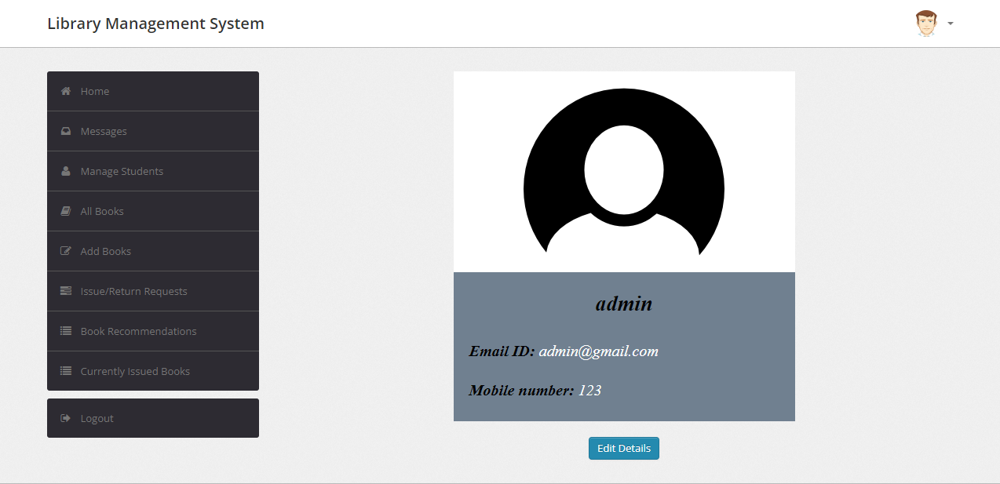
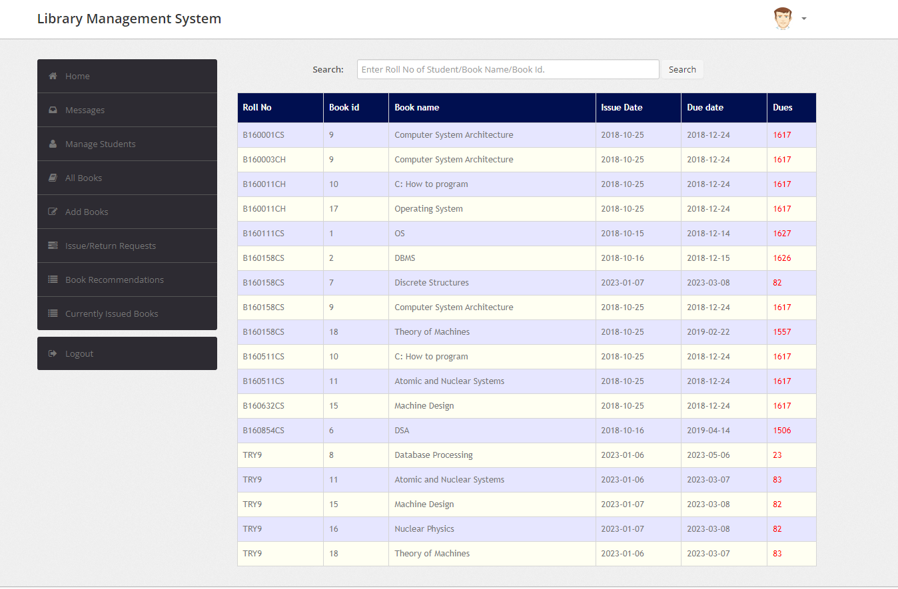
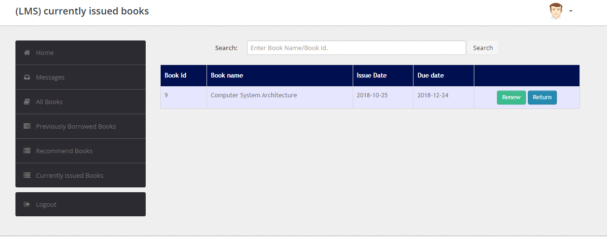

# Library_Management_System

### This web-based system allows for seamless cataloging, tracking, and retrieval of library resources, enabling efficient circulation, inventory management, and resource allocation. By integrating features such as user registration, book reservations, and book recommendations, the LMS significantly improved user engagement and satisfaction.

## Login

## Admin

## Student

